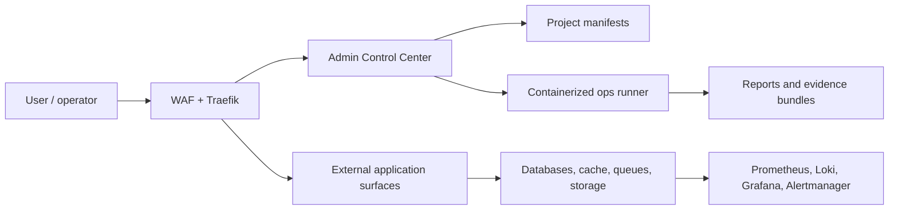

# Platform Infrastructure

Docker-first, white-label infrastructure and control-plane framework for self-hosting applications with backup, restore, observability, security gates, release evidence and production go/no-go.

## What is this?

Platform Infrastructure is an infrastructure repository, not an application monorepo. It provides a reusable self-hosting foundation around Docker Compose, an Admin Control Center, hardened reverse proxy/WAF routing, databases, queues, storage, monitoring, backup/restore automation and release evidence.

It is designed to stay white-label. Application projects live outside this repository and are attached through manifests, runtime configuration, digest-pinned images and release evidence.

## What it provides

- Docker-first local and VPS profiles.
- Admin Control Center at `admin.<domain>`.
- Project inventory and runtime metadata without storing application source here.
- Traefik, OWASP CRS WAF, Keycloak, MinIO, PostgreSQL, MariaDB, Redis, NATS, Prometheus, Loki, Grafana and Alertmanager integration.
- Backup, restore, DR, retention and evidence scripts.
- GitHub Actions, SBOM, provenance and GitHub/Sigstore release attestation flow.
- Production go/no-go checks that distinguish repo-ready, environment-ready and live-proof states.

## What it does not do

- It does not contain customer or product application code.
- It does not make a production system safe without live evidence.
- It does not require Cloudflare, Hostinger or any single provider.
- It does not commit `.env`, secrets, backups, reports, dumps or generated evidence bundles.
- It does not expose database/admin tools publicly by default.

## Who it is for

- Maintainers building a self-hosted internal platform.
- Small teams moving from ad-hoc VPS hosting to repeatable infrastructure.
- Operators who want evidence-based deployment gates before production.
- Agencies or product teams needing a white-label foundation for multiple clients.

## Architecture at a glance



See [Architecture](docs/architecture.md) for components, trust boundaries and evidence flow.

## Local quickstart

```sh
cp .env.example .env
sh ./scripts/infra-secret-manager.sh init
docker compose --env-file .env -p platform_infra_local -f compose.yaml -f compose.build.yaml -f compose.secrets.yaml up -d --build
sh ./scripts/infra-health.sh
```

For mkcert, hosts file setup, logs, stop/reset and troubleshooting, see [Quickstart](docs/quickstart.md).

## Local URLs

The conventional local hostnames are:

| Surface | URL |
| --- | --- |
| Public app | `https://app.localhost.com` |
| Admin Control Center | `https://admin.localhost.com` |
| API | `https://api.localhost.com` |
| Auth / Keycloak | `https://auth.localhost.com` |
| Storage / MinIO console | `https://storage.localhost.com` |
| Grafana | `https://grafana.localhost.com` |
| Docs | `https://docs.localhost.com` |

The Admin Control Center is `admin.localhost.com`. `projects` is an internal section of the Control Center, not the control-plane hostname. Some profiles keep only admin/docs public and leave API, auth, storage and observability internal or protected.

## Admin Control Center

The Control Center is a Node service used for inventory, project metadata, read-only topology, adapters, evidence, settings and docs. Simple mode is for daily operation; advanced mode exposes governance, security and provider planning surfaces. Apply-style actions require explicit live adapters and confirmation.

Read [Control Center](docs/control-center.md).

## Project manifests

Application projects stay outside this repository. Attach them through neutral project manifests and digest-pinned release subjects. Supported runtime classes include static, node, php, python, docker-custom and worker/cron.

Read [Project Manifest](docs/project-manifest.md).

## Provider profiles

`PROVIDER_PROFILE` describes environment behavior. Supported examples include `local`, `home-vps`, `generic-vps`, `hostinger`, `aws` and `custom`. Provider profile is configuration, not branding.

Read [Providers](docs/providers.md).

## Security model

The baseline includes Docker secrets, secret manager metadata, WAF rules, rate limiting, admin auth, log redaction, backup encryption, supply-chain checks and release attestation. Public database/admin surfaces are not part of the default security posture.

Read [Security Model](docs/security-model.md) and [Security Baseline](SECURITY.md).

## Backup and disaster recovery

The repo includes backup and restore scripts for PostgreSQL, MariaDB, MinIO/storage, Keycloak and secret manager metadata, plus restore drills, retention evidence and off-site restore support.

Read [Backup/Restore](docs/backup-restore.md) and [Disaster Recovery](docs/disaster-recovery.md).

## Observability and alerting

Prometheus, Loki, Promtail, Grafana, Alertmanager and worker notifications are configured for metrics, logs, alert routing and evidence. Real production go/no-go requires verified external uptime and real alert delivery evidence.

Read [Observability](docs/observability.md).

## Release evidence and GitHub/Sigstore

Release evidence can validate digest-pinned images, SBOMs, rollback targets, local provenance and GitHub Artifact Attestations/Sigstore. GitHub-signed attestations require a real GitHub Actions run and real artifact/image subjects.

Read [GitHub/Sigstore](docs/github-sigstore-attestations.md) and [Release Evidence](docs/release-evidence.md).

## Production go/no-go

Production go/no-go is a hard gate. A home VPS can be production-like without being production-go until DNS/TLS, external uptime, alert delivery, off-site backup/restore, release evidence and evidence bundles are verified.

Read [Production Go/No-Go](docs/production-go-no-go.md).

The current live production readiness report is tracked in [READINESS-REPORT.md](READINESS-REPORT.md). Treat it as evidence status, not as a replacement for fresh live provider verification.

## Documentation map

Start with [docs/README.md](docs/README.md). Key root documents remain:

- [Runbook](RUNBOOK.md)
- [Security Baseline](SECURITY.md)
- [Threat Model](THREAT-MODEL.md)
- [Enterprise Maturity](ENTERPRISE-MATURITY.md)
- [Enterprise 10 Plan](ENTERPRISE-10-PLAN.md)
- [Readiness Report](READINESS-REPORT.md)
- [Final Readiness Audit](FINAL-READINESS-AUDIT.md)
- [VPS Checklist](VPS-PREDEPLOY-CHECKLIST.md)

## Contributing

See [CONTRIBUTING.md](CONTRIBUTING.md). Contributions must keep the repository white-label, avoid live provider mutation unless explicitly scoped, avoid secrets, and update docs when behavior changes.

## License

Licensed under the Apache License, Version 2.0. See [LICENSE](LICENSE).
